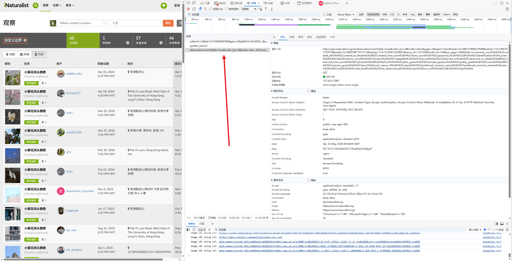

# iNaturalist 观测图片批量下载工具

批量下载 iNaturalist 观测数据和图片的工具，支持图形界面和命令行两种方式。

## 功能特性

- 从 iNaturalist 观测页面批量获取数据
- 自动导出 CSV 文件，方便 Excel 查看
- 可选下载高清原图 (large)
- 可选打包结果为 zip 文件
- 支持图形界面和命令行

## 环境要求

- Python 3.8+
- Windows / macOS / Linux

## 安装

```bash
# 克隆仓库
git clone https://github.com/yourusername/get-bird-data.git
cd get-bird-data

# 安装依赖
pip install -r requirements.txt
```

## 图形界面（推荐）

```bash
python app.pyw
```

启动 Qt 图形界面，粘贴观测地址即可使用：
- 自动获取数据并导出 CSV
- 可选下载图片
- 可选打包结果

## 命令行使用

### 1. 获取请求链接

访问 iNaturalist 观测页面：

样例：https://www.inaturalist.org/observations?nelat=22.288157898233948&nelng=114.1400703753579&subview=table&swlat=22.280076871675714&swlng=114.13105815335801&taxon_id=116759

打开 F12 开发者工具，找到 Network 面板中的 API 请求：



### 2. 复制链接到 url.txt

将请求链接复制到 `url.txt` 文件中

### 3. 获取数据

```bash
python fetch_data.py
```

从 `url.txt` 分页获取所有观测数据，保存到 `observations.json`，并自动将缩略图 URL (square) 替换为高清原图 (large)

### 4. 下载图片

```bash
python download_from_json.py
```

从 `observations.json` 下载所有图片到 `photos/` 目录

### 5. 导出 CSV（可选）

```bash
python json_to_csv.py
```

将 `observations.json` 转换为 `observations.csv`，方便在 Excel 中查看

### 6. 打包结果（可选）

```bash
python pack_results.py
```

将图片、CSV、JSON 打包为 zip 文件，包含观测页面链接

## 文件说明

| 文件 | 说明 |
|------|------|
| app.pyw | Qt 图形界面应用 |
| url.txt | 存放 API 请求链接 |
| fetch_data.py | 分页获取观测数据并保存为 JSON |
| download_from_json.py | 从 JSON 文件批量下载图片 |
| json_to_csv.py | 将 JSON 数据转换为 CSV |
| pack_results.py | 打包所有结果为 zip 文件 |
| requirements.txt | Python 依赖 |
| LICENSE | MIT 开源协议 |

## 数据来源

本工具使用 [iNaturalist API](https://api.inaturalist.org/v2/) 获取观测数据。iNaturalist 是一个公民科学平台，数据遵循 [CC BY-NC 协议](https://creativecommons.org/licenses/by-nc/4.0/)。

使用本工具下载的数据请遵守 iNaturalist 的[使用条款](https://www.inaturalist.org/pages/terms+of+use)。

## 贡献

欢迎提交 Issue 和 Pull Request！

## 免责声明

**本项目仅供学习和研究使用。**

- 本工具仅用于学习 Python 爬虫和数据处理技术，请勿用于商业用途
- 使用本工具时请遵守 [iNaturalist 使用条款](https://www.inaturalist.org/pages/terms+of+use)
- 请尊重数据创作者的版权，下载的数据版权归原作者所有
- 使用本工具造成的任何法律责任由使用者自行承担
- 请合理使用，避免对 iNaturalist 服务器造成过大负担

如有任何侵权问题，请联系删除。

## 开源协议

本项目采用 [MIT 协议](LICENSE) 开源。
